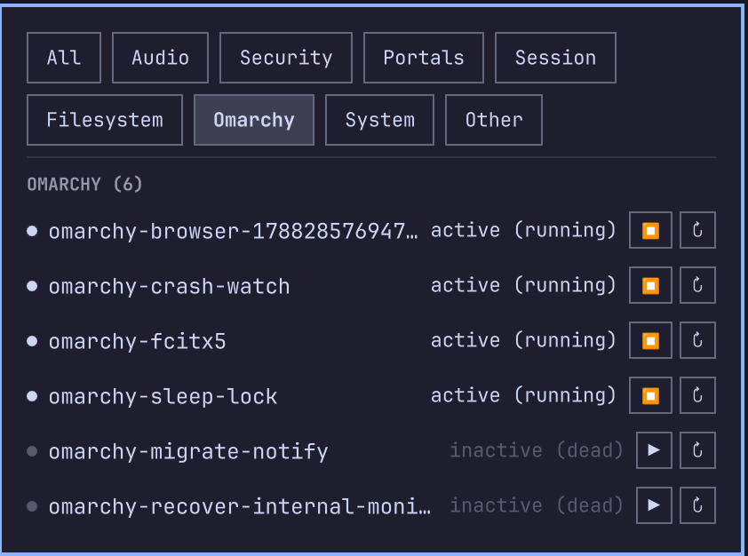

# Systemd User Services (Omarchy plugin)

List and control `systemctl --user` services from the Omarchy bar, grouped
into tabs instead of one long flat list.

- Bar icon shows a warning badge with the failed-service count, or a quiet
  gear icon when everything's fine.
- Click it to open a panel with a proper title and a live status line
  ("46 services, all healthy", turning red the moment something fails),
  same style as Omarchy's own network/bluetooth panels.
- Below that, every user service, failed ones first, then running, then
  the rest, each with a colored state dot — and that same color runs
  through the name and state label too, so a failed row is unmistakable
  at a glance.
- Services are grouped into tabs by what they actually are (Audio, Security,
  Portals, Session, Filesystem, Omarchy, System, Other), plus an All tab —
  see "Category taxonomy" below for how that's decided.
- Start/Stop and Restart on every row, icon buttons with a tooltip so you
  know what they do. The toggle switches to whichever action makes sense
  for that unit's current state. Buttons disable while an action's running,
  and a failed action shows an error naming the unit and what went wrong.




## Scope (MVP)

- `systemctl --user` units only — no root/system-wide units, no privilege escalation.
- Lists, categorizes, and controls (start/stop/restart) every unit, and
  flags failures. Only one action runs at a time across the panel.
- No enable/disable (autostart toggle), no log tailing, no notifications,
  no search/filter yet — see Roadmap.
- Polling-based refresh (default every 10s, configurable 5–300s), not D-Bus signals.

## Configuration

Set via the bar widget's settings (`refreshIntervalSec` in `manifest.json`'s
`barWidget.schema`, editable through Omarchy's bar-widget settings UI or
directly in `~/.config/omarchy/shell.json`'s layout entry for this plugin):

| Key | Type | Default | Range | Description |
|---|---|---|---|---|
| `refreshIntervalSec` | integer | `10` | 5–300 | How often `Service.qml` re-polls `systemctl --user list-units` |

## Install

```sh
omarchy plugin add https://github.com/aholbreich/systemd-user-services.git --enable
```

## Uninstall

```sh
omarchy plugin remove io.github.aholbreich.systemd-user-services
```

## Development

This repo doubles as a working checkout: the plugin loads straight from it
via a symlink, no `omarchy plugin clone` needed while developing locally.

```sh
ln -s "$(pwd)" ~/.config/omarchy/plugins/io.github.aholbreich.systemd-user-services
omarchy plugin enable io.github.aholbreich.systemd-user-services
omarchy-restart-shell   # see "hot-reload is unreliable" gotcha below
qs log -p "$OMARCHY_PATH/shell" --tail 100   # check for errors

# ground truth for "is it actually visible", not just "no errors":
omarchy-shell shell debugBarGeometry   # look for our id; width/height must be > 0
grim /tmp/bar-check.png && magick /tmp/bar-check.png -crop 900x60+2940+0 +repage /tmp/bar-right.png

# static checks (must be run with node_modules absent — see gotcha below):
rm -rf node_modules
omarchy plugin validate .
/usr/lib/qt6/bin/qmllint -I "$OMARCHY_PATH/shell" Panel.qml Service.qml
npm install   # restore node_modules for the automated suite below

# automated BDD suite (pure-logic stories only — see Testing strategy):
npm test
```

**Gotcha:** `omarchy plugin validate` walks the whole plugin folder looking
for disallowed symlinks, and npm's `node_modules/.bin/*` are symlinks — so
validate fails while `node_modules` is present. A real user's `git clone`
never has `node_modules`, so this only bites local dev; `rm -rf node_modules`
before validating, `npm install` again before running tests.

**Every bar-widget root must size itself, or it silently renders at 0×0.**
The bar computes each widget's slot from `activeItem.implicitWidth` /
`implicitHeight` — if `Panel.qml`'s root doesn't set those (typically
`implicitWidth: button.implicitWidth` / `implicitHeight: button.implicitHeight`,
mirroring the shipped `tailscale`/`bluetooth` plugins), the widget mounts
(`omarchy plugin list` shows `enabled: true`, the log shows no errors) but
paints nothing and takes zero space. `qs log` and `omarchy plugin validate`
being clean is **not** proof the widget is visible — check
`omarchy-shell shell debugBarGeometry` (find your id, confirm width/height
> 0) or take a real screenshot before calling a UI story done.

**Hot-reload is not reliable for structural changes.** The
`Local plugin changed, reloading` debug log line does not reliably refire on
every edit, and neither `omarchy-shell shell rescanPlugins` nor a full
`omarchy plugin disable`+`enable` cycle is guaranteed to pick up a change —
in practice only `omarchy-restart-shell` (which kills and relaunches the
`quickshell` process) reliably forces a fresh compile from disk. Don't trust
the reload log line as proof of a live update; re-check geometry/screenshot
after a real restart.

**qmllint warning noise is expected.** Quickshell's `qs.*` import namespace
(`qs.Commons`, `qs.Ui`, and shell-provided types like `Panel`/`WidgetButton`)
is resolved at runtime by Quickshell itself, not statically by `qmllint` —
even Omarchy's own first-party plugins produce hundreds of `unresolved-type`
/ `unqualified` warnings under the exact command above. Judge by **exit
code**, not warning count, when checking whether qmllint is "clean".

**Because qmllint can't resolve `qs.*`, it also can't catch an invented
token on `Color`/`Style`.** `qmllint` exiting 0 does not mean `Color.error`
or `Style.font.small` are real properties — they aren't (real ones:
`Color.urgent`/`foreground`/`muted`/`accent`, `Style.font.bodySmall`/`body`/
`caption`/etc; see `$OMARCHY_PATH/shell/Commons/{Color,Style}.qml`). A typo'd
token silently evaluates to `undefined` and only surfaces as a runtime
warning (`Unable to assign [undefined] to int/color`) after a real restart —
grep the actual Commons source for a token before using it, don't guess from
convention or memory.

## Category taxonomy

systemd carries no semantic category metadata for units, so the panel's tabs
are a hand-curated keyword lookup (`Model.js`'s `CATEGORY_DEFINITIONS`)
matched against each unit's short name, not the original task description's
illustrative `media/network/sync/dev/utilities` examples — those don't fit
what actually runs on an Omarchy desktop. The set below was derived from this
machine's real 46-unit census (`systemctl --user list-units`), which came out
dominated by desktop-session plumbing rather than end-user apps:

| Tab | Keywords (substring match on short name) | Rationale |
|---|---|---|
| Audio | `pipewire`, `pulseaudio`, `wireplumber` | The audio stack |
| Security | `keyring`, `gpg-agent`, `dirmngr`, `keyboxd`, `p11-kit`, `bt-agent` | Credential/keyring/pairing agents |
| Portals | `xdg-`, `portal`, `at-spi`, `dbus-broker`, `dbus-:`, `dconf` | Desktop-integration buses and sandboxing portals |
| Session | `wayland-session`, `wayland-wm` | The compositor/session lifecycle itself |
| Filesystem | `gvfs` | Virtual filesystem / volume monitoring |
| Omarchy | `omarchy-` | Omarchy's own scripts/services |
| System | `systemd-` | systemd's own user-level daemons |
| Other | (no match) | Catch-all — on this machine: a trading-platform gateway, a voice-to-text daemon, and a couple of app-specific autostart notifiers |

Matching is substring-based against the lowercased short name (keyword order
matters — first match wins, most-specific categories first), not exact/prefix
matching, since escaped systemd unit names
(`app-gnome\x2dkeyring\x2dpkcs11@autostart`) don't survive a strict prefix
check. On this machine's real census, only 4/46 units (~9%) land in Other.

Tabs are a **fixed set** (`Model.CATEGORY_KEYS`), always shown even at a
count of 0 with their own empty state — not derived from what's currently
populated — so the tab row doesn't reflow as services start/stop.

Extending the taxonomy is a one-line addition to `CATEGORY_DEFINITIONS` in
`Model.js`; add a matching row to `Scenario Outline` in
`features/organize_panel_into_semantic_tabs.feature` first.

## Panel conventions

The header (icon, bold title, small-caps status line) copies the shipped
network/bluetooth panels' hero pattern rather than inventing a look — same
`Style.font.display` icon size, same bold title, same all-caps
`Style.font.caption` status line below it. Spacing uses the real named
tokens (`Style.spacing.panelGap`, `.rowGap`, `.popupRowHeight`, etc.) instead
of raw pixel values, and row state color (urgent/foreground/muted) now
applies to the dot, name, and state label together rather than just the dot
and label — this theme has no separate "success" color, so "running" just
means full-brightness foreground, not a color that doesn't exist here.

## Testing strategy

- **Automated (`npm test`, cucumber-js + Gherkin):** anything expressible as
  pure logic without Quickshell — currently `Model.js`'s parsing/sorting/
  classification. Feature files are tagged `@automated`.
- **Manual/live (`@manual` tagged scenarios in the same `.feature` files):**
  anything that only exists once QML is actually rendered by the running
  shell (bar icon, panel layout, click handling) — there is no headless
  Quickshell test runner. These scenarios are the acceptance checklist to
  walk through against the real bar (symlinked in as above) after each
  story lands.
- **Static gates on every story regardless of the split above:**
  `omarchy plugin validate .` and `qmllint` must both exit 0.

`Model.js` has no Quickshell dependency and can be exercised with plain Node
for quick unit-parsing checks.

## Roadmap ideas

- Enable/disable toggle (autostart) per unit.
- Inline `journalctl --user -u <unit> -n 20` tail per row.
- Notification (`notify-send`) when a unit transitions into `failed`.
- Search/filter box, group headers, restart confirmation for active units.
- Optional read-only view of system-wide (non-`--user`) units.
- Move refresh from polling to systemd's user D-Bus signals.
